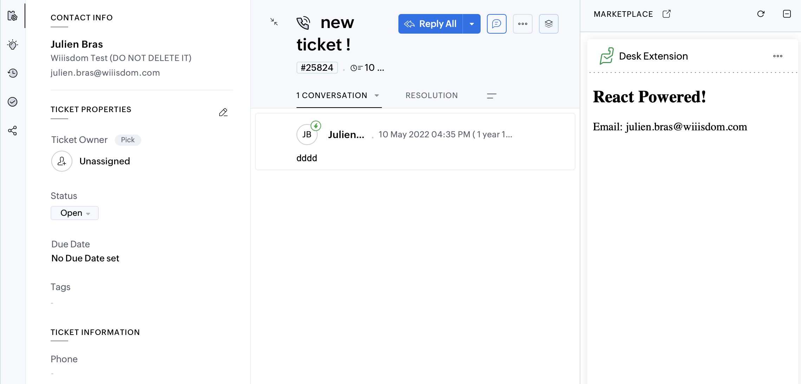

# Example Zoho Desk Extension

## Getting Started

You can follow the guide [here](https://www.zoho.com/desk/extensions/guide/test-extension.html), but in a nutshell:

```bash
yarn # install deps
zet run # run locally
```

And then be sure to activate the Developer mode on Zoho Desk side.



## How to pack the extension for a release?

```bash
zet validate # validate before packing
zet pack 
```

## Technical information

- This extension is relying on `ts-loader` in the webpack configuration to read the `tsx`/`ts` files.
- The `ZOHODESK` object type is declared in `globals.d.ts`. I have begun extending it, but it's far from complete.
- components are located in `src/components`, see the basic `App.tsx`
- a basic test is build in `test/components`, it is relying on `vitest`.

## Other info about the project

I've made a type helper to compile types into common index files. [See Types to Index](./types-to-index.md)

## License

This template is available under the MIT license.

## Author

- Tim Hill (following the work of Julien Bras at Wiiisdom )
